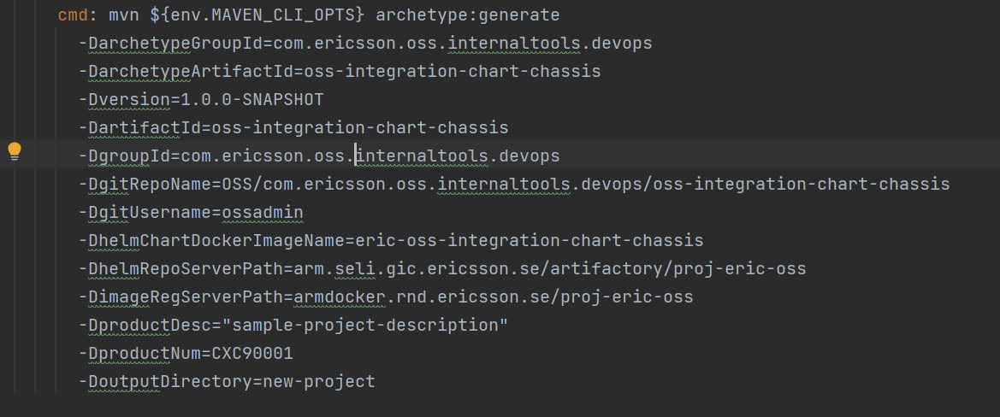
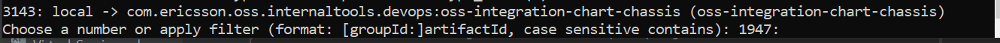

# Maven Archetype

[TOC]

Maven archetype is used to create projects and it source main resources archetype-resources.

1) Clone the repo OSS/com.ericsson.oss.internaltools.devops/oss-integration-chart-chassis.

2) Run "mvn clean install" within the cloned repository, in order to add the archetype project to your local maven .m2 repository (to use latest it must be done every time when new version of the archetype is generated or one can add additional param '-DarchetypeVersion="$VERSION" ', where "$VERSION" is the version of the archetype you would like to run.).

3) Run "mvn archetype:generate -B <list of params> to generate new project.

   Example of list of parameters:

   > Note: This will require an empty directory (Outside of the cloned repository).

   > Note: If you have followed the above steps the following (Or similar if a version is provided) will be shown, please select the relevant number to create the chart (In this example: 3143 as it is the local maven archetype of the oss-integration-chart-chassis)

4) Alternatively, run bob rule "generate-project" before that updating params in the rulesetfile to what is needed.

   List of params that are specified in the bob rule "generate-project":
   -DartifactId=<sample-project>
   -DgroupId=<com.ericsson.de>
   -DgitRepoName=<OSS/com.ericsson.oss.de/sample-project>
   -DgitUsername=ossadmin
    >> Note: this is needed and will depend on the functional user where the jobs for newly created project will run.

   -DhelmChartDockerImageName=<eric-sample-project>
   -DhelmRepoServerPath=arm.seli.gic.ericsson.se/artifactory/proj-eric-oss
    >> Note: this is reusing OSS common artifactory set up by Hummingbirds.

   -DimageRegServerPath=armdocker.rnd.ericsson.se/proj-eric-oss
    >> Note: this is reusing OSS common artifactory set up by Hummingbirds.

   -DproductDesc="<sample-project-description>"
    >> Note: It's an optional parameter.

   -DproductNum=CXC90001  --> default number if not known
   -DoutputDirectory=new-project

5) A new project is generated in the "new-project" folder (or name given in DoutputDirectory parameter).h

>> Note: can be omitted if one passes in the released archetype version and settings file is configured with access to artifactory, this is  handy when including "archetype:generate" in a automation to generate new projects from an archetype.

For further information please follow [microservice-chassis README](https://gerrit-gamma.gic.ericsson.se/gitweb?p=OSS/com.ericsson.oss.de/microservice-chassis.git;a=blob_plain;f=README.md;hb=refs/heads/master).