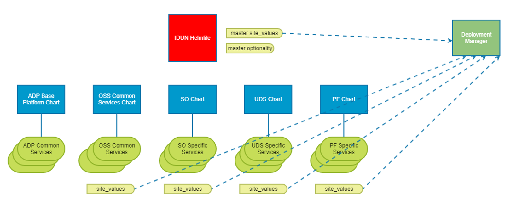

# Site Values Template File

[TOC]

The document describes the purpose and usage of the Site Values file within the chart, [site-values-template.yaml](../charts/__helmChartDockerImageName__/site_values_template.yaml).

This file is used to expose customer site specific information for which no default values can exist.

Examples of values that need to be exposed are hostnames, usernames and passwords, persistent volume sizes etc.

Each Applciation chart delivered will have their own site values to expose customer site specific information, for their application.

It is the responsibility of the Application to ensure all the required keys are exposed in the site values template file.

> **Note:** You cannot add a change to another Application's values from your own Application Site Values.

Each Application (SO, PF, DMM etc.) will have their own Site Values file, which exposes customer site specific
information that needs to be populated by the customer for their application to configure correctly.

The Site values template, e.g. [site-values-template.yaml](../charts/__helmChartDockerImageName__/site_values_template.yaml),
should be stored within the chart directory of the repo. This ensure it is delivered out with the chart tar file once released.

The deployment manager tool will be used to gather all these site values from the Application charts,
which will be used to build up an overall site values file for the customer to populate.
The gathering of the site values is performed by executing the "prepare" command from deployment manager.

There are also master site values sitting at the project helmfile level. These site values are mainly used to expose project specific customer keys.
 These can be found in the Product Helmfile Repo
- [EIAP master site values file](https://gerrit-gamma.gic.ericsson.se/plugins/gitiles/OSS/com.ericsson.oss.eiae/eiae-helmfile/+/master/helmfile/templates/site-values-template.yaml)
- [EO Helmfile Site Values File](https://gerrit-gamma.gic.ericsson.se/plugins/gitiles/OSS/com.ericsson.oss.eo/eo-helmfile/+/2c8436240d68cc3d37f0e1a37133dd55db053685/helmfile/templates/site-values-template.yaml).

Diagram below illustrates the gathering of the site values from the application chart when the prepare command is executed
using the deployment manager.

> - Note: When adding values to the Site Values File, you need to ensure the relevant CPI documents have been updated

1. My Application chart (eric-oss-example-chart) needs to expose a default username and password for a system user.

2. Approval from the [Application Architects](https://pdu-oss-tools5.seli.wh.rnd.internal.ericsson.com/product_role_matrix_new/login.html#osc)
is required in order to expose new keys to the customer.

3. Once we have Approval, we then need to prepare a CPI update (Install/Upgrade Guides) in order to document these new
keys for the customer.

4. The CI site values will then need to be updated in order to allow the change to work within CI. This can be achieved
by creating a support ticket on the TicketMaster team ([TicketMaster Support Ticket](https://jira-oss.seli.wh.rnd.internal.ericsson.com/browse/IDUN-4091)
with your change request and approval attached.

5. An associated update is required to the Values Schema ([Values Schema](../charts/__helmChartDockerImageName__/values.schema.json)
in the Application repo so that verification can be done on this new key to ensure the customer fills it in correctly.

6. Finally, once we have finished all the previous steps, in order to set a default username and password for the system
user (system-user), we must expose the new keys within the [Site Values file](../charts/__helmChartDockerImageName__/site_values_template.yaml)
of our Application's repo.

> **Note:** Changes to the Site Values file template should not be merged until the relevant CPI changes have been
reviewed and are ready to be submitted. Also note that CI deployments may fail unless the necessary CI changes to site values have been merged.